# Changelog 
2020.4.20

1. Support sensor,like bme680, lis3dh, lps22hb, max_7q, opt3001, shtc3
2. Support IO, like RS485, GPIO

# RAK811_LoRaWAN_Arduino 
2019.12.30

Firstly, thank you very much to @sabas1080 for his contribution to RAK811 LoRa Tracker board + Arduino.

# What is Arduino?

Arduino is the world’s leading open-source hardware and software ecosystem. The Company offers a range of software tools, hardware platforms and documentation enabling almost anybody to be creative with technology.

Arduino is the first widespread open-source hardware project and was set up to build a community that could help spread the use of the tool and benefit from contributions from hundreds of people who helped debug the code, write examples, create tutorials, supports other users on the forums and build thousands of groups around the globe. We are eternally grateful for being supported by such an amazing community.

If you want to know more about Arduino, please refer to its official website:  

[https://www.arduino.cc/](https://www.arduino.cc/)

# Install the Arduino IDE  
First of all, the IDE to be used is the official Arduino IDE. This is an open-source software that can be downloaded from here:
[https://www.arduino.cc/en/Main/Software](https://www.arduino.cc/en/Main/Software)

# Install Additional Libiraries
The RAK811 module is integrated with a Semtech's SX1276 transceiver and a STM32L151 MCU. In order to work with the Arduino IDE, the STM32 Core library has to be installed. For this tutorial, the SMT32 Core library, version 1.9.0 was tested. 

## Install STM32 Core Library  
To install the STM32 Core library,  Arduino IDE allows configuring additional URL for third-party libraries. This configuration is done through the **Preference** form of the Arduino IDE. Open this form by clicking on the menu of Arduino IDE: File->Preference, then add the following entry in the **Additional Boards Managers URLs**

"https://github.com/stm32duino/BoardManagerFiles/raw/master/STM32/package_stm_index.json"

  


Then, close the form by clicking on the "Ok" button. Now, open the Board Manager by clicking on the menu of Arduino IDE: Tools->Board->Board Manager...

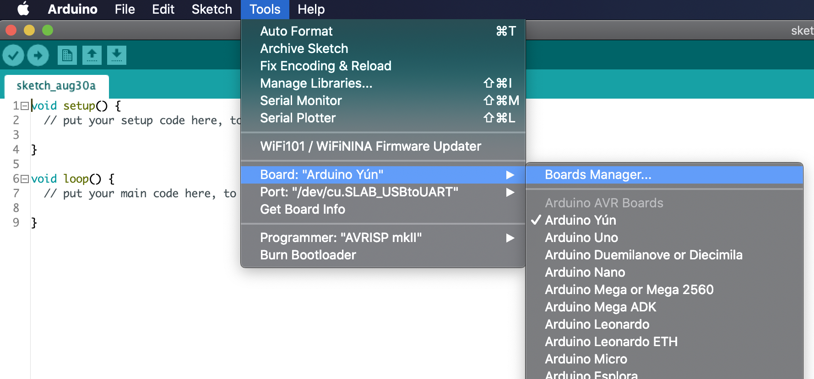


Search for "STM32 Cores"


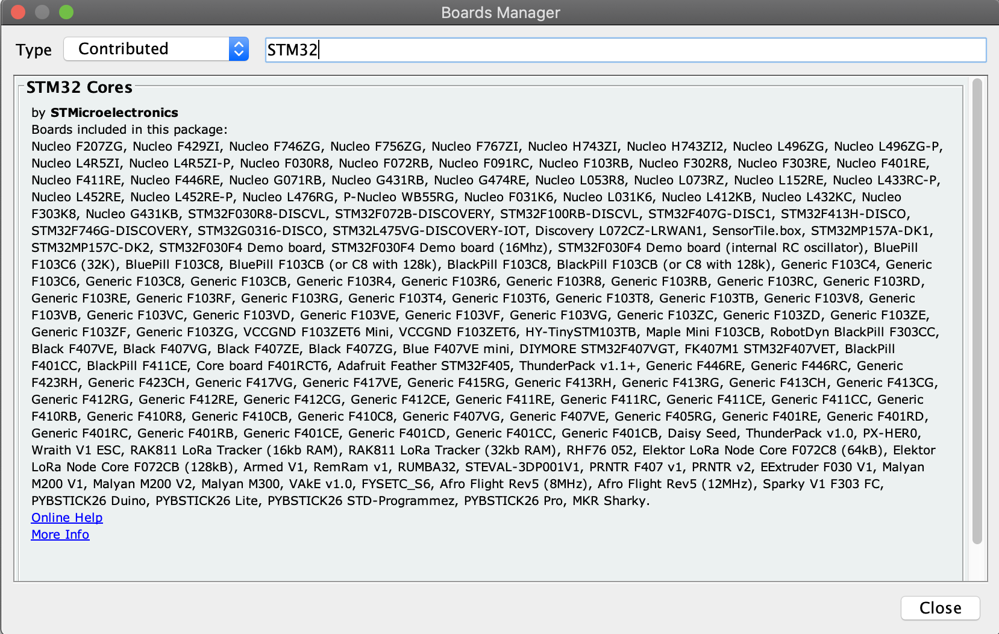

Then, choose the version 1.9.0 and click on the Install button. The Arduino IDE will download and install this library. This process could take several minutes. 
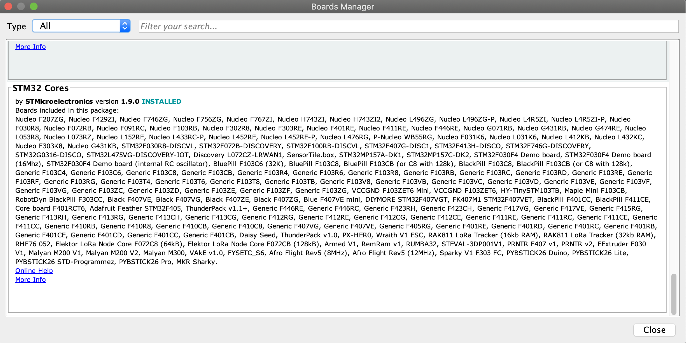

Once the STM32 Core library is installed, more options are shown in the Tool->Board menu. Open this menu and choose "LoRa boards". Then choose the "RAK811 LoRa Tracker (16kb RAM)" alternative in the menu Tools->Board part number. 


## Install MCCI LoRaWAN LMIC Library 
Additionally, the LoRaWAN library has to be installed. Using the Library Manager, as done before, install the MCCI LoRaWAN LMIC Library. For this demo, the version 3.0.99 is selected. 

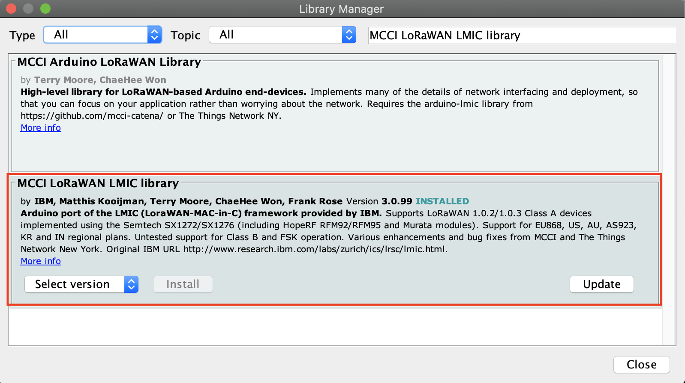

## Install STM32CubeProgrammer

The STM32CubeProgrammer is used for deploying the binary created by the Arduino IDE. To install STM32CubeProgrammer, follow these instructions:


  - install Java JDK 1.8 
  - install the [STM32CubeProgrammer](https://www.st.com/en/development-tools/stm32cubeprog.html)
  - Configure the Arduino IDE. Select STM32CubProgrammer (Serial) in Tools->Upload method. 

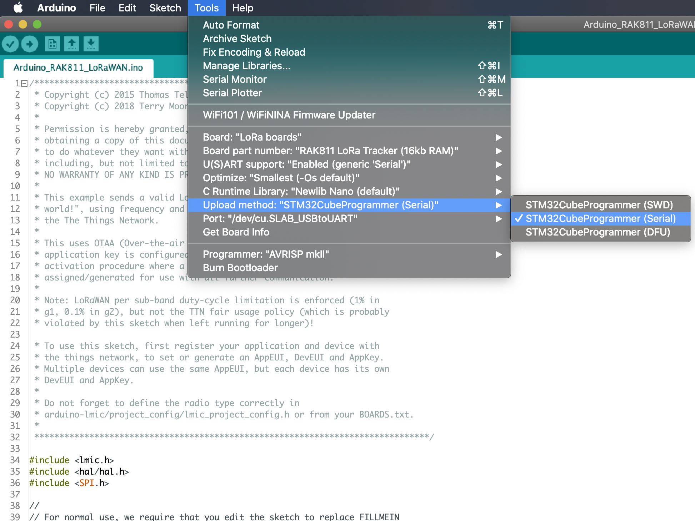

## Select the Serial Port 

Now, connect the USB cable to the RAK811 module and select in the Arduino IDE the serial port detected by the operative system. In this example, the /dev/cu.SLAB_USBtoUART port was selected. 

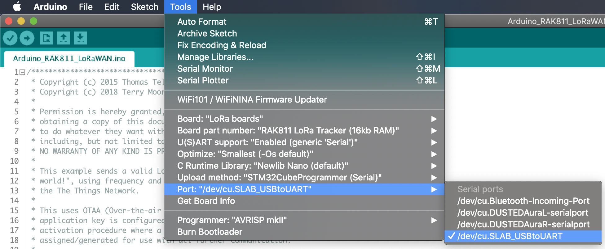

Now the environment is properly configured. It's time to create an application in the Arduino IDE and test the RAK811 board.


## Create a First LoRa Project 
Download and open in the Arduino IDE the [Arduino_RAK811_LoRaWAM.ino](Arduino_RAK811_LoRaWAN/Arduino_RAK811_LoRaWAN.ino) 

Configure the following LoRaWAN parameters:


  - AppEUI: 0x55,0x89,0x29,0x19,0xDB,0x6C,0xF3,0x28
  - DevEUI: 0xA2,0xAA,0xAA,0xAA,0xAA,0xAA,0xAA,0xAA}
  - APPKey: 0x4B,0x26,0x71,0x57,0x69,0xCA,0xDD,0x1C,0xCC,0x0B,0xDB,0xBB,0x6C,0x96,0x1F,0x36


```
static const u1_t PROGMEM APPEUI[8]={0x55,0x89,0x29,0x19,0xDB,0x6C,0xF3,0x28};

void os_getArtEui (u1_t* buf) { memcpy_P(buf, APPEUI, 8);}

// This should also be in little endian format, see above.
static const u1_t PROGMEM DEVEUI[8]={0xA2,0xAA,0xAA,0xAA,0xAA,0xAA,0xAA,0xAA};
void os_getDevEui (u1_t* buf) { memcpy_P(buf, DEVEUI, 8);}

// This key should be in big endian format (or, since it is not really a
// number but a block of memory, endianness does not really apply). In
// practice, a key taken from ttnctl can be copied as-is.
static const u1_t PROGMEM APPKEY[16] = { 0x4B,0x26,0x71,0x57,0x69,0xCA,0xDD,0x1C,0xCC,0x0B,0xDB,0xBB,0x6C,0x96,0x1F,0x36 };
```

The pin configuration between the STM32L MCU and the LoRa SX1276 transceiver is defined as the following. Don't change it. 

```
// Pin mapping
const lmic_pinmap lmic_pins = {
    .nss = 26,
    .rxtx = 32,
    .rst = 21,
    .dio = {27, 28, 29},
};
```

Now, click on the "Verify" (compile) button. Make sure compilation finishes successfully. 

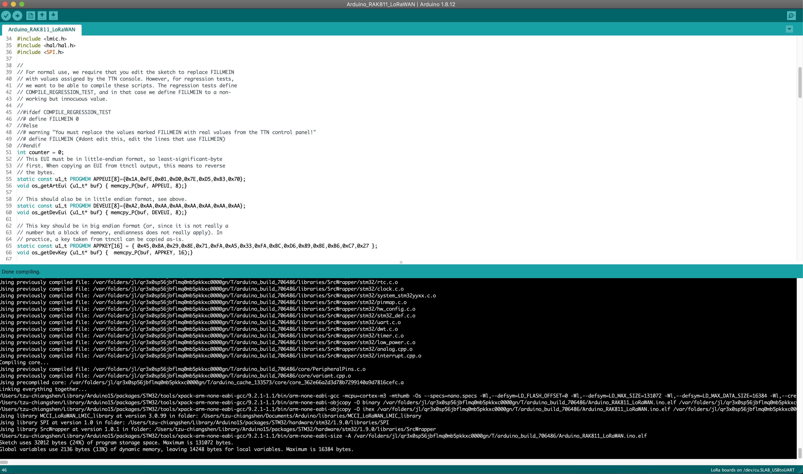

Switch the RAK811 into BOOT mode by connecting the BOOT0 pin to VDD. Then, press the reset button in the RAK811, and click on the "Upload" button on the Arduino IDE. The following image shows a successful upload log.

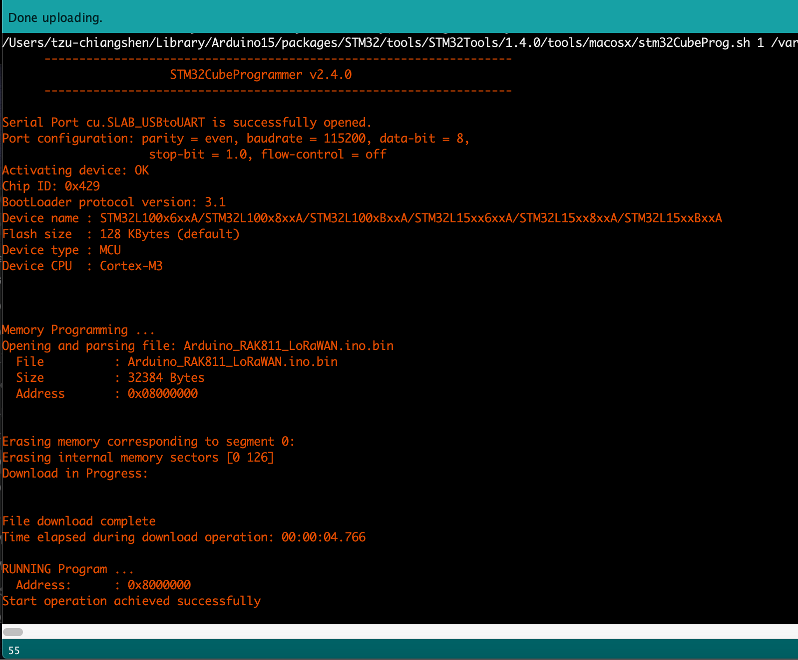

If the RAK811 didn't enter properly to the BOOT mode, the following error messages will be shown. 

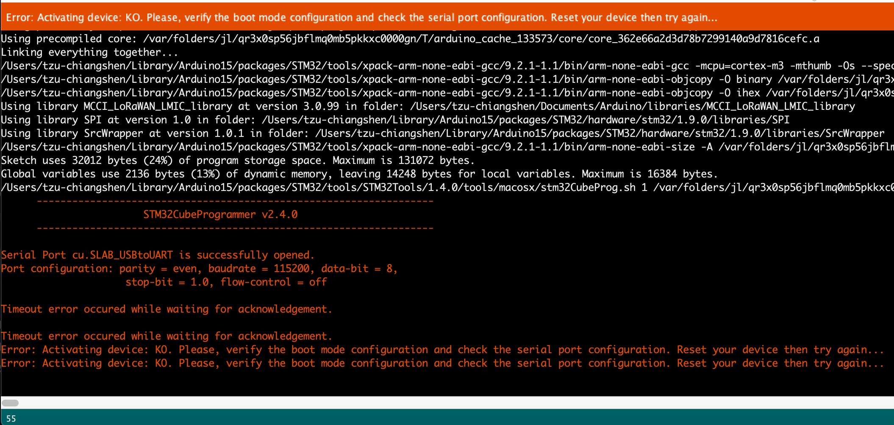

After uploading the binary, disable the BOOT mode, reset the RAK811 and open the Serial Monitor (Tool->Serial Monitor). Verify that the RAK811 is trying to join into a LoRaWAN network. If a LoRaWAN gateway is available, and the join message was accepted, then the RAK811 would start sending messages infinitely.

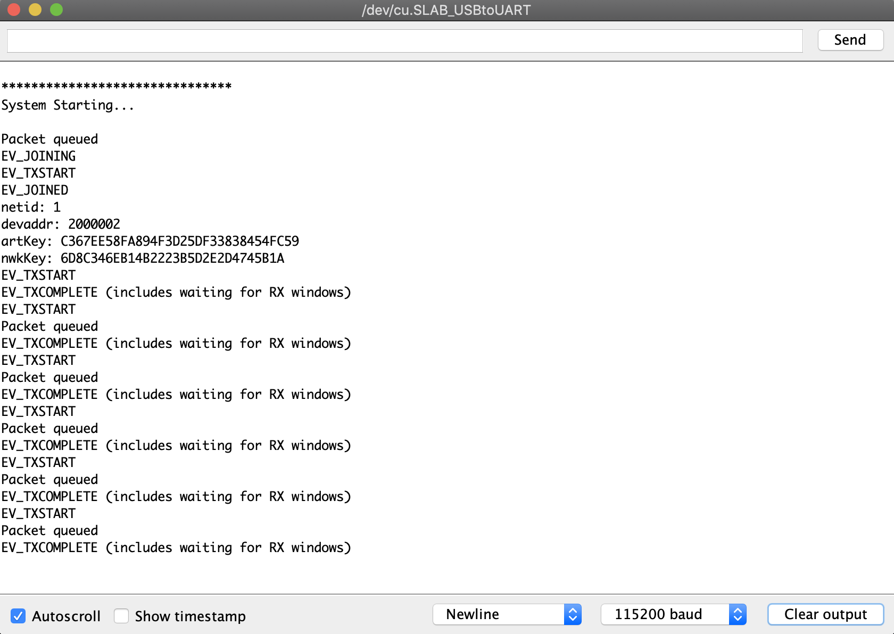

In the following image, a message sent by the RAK811 is properly received by a RAK7249 gateway.

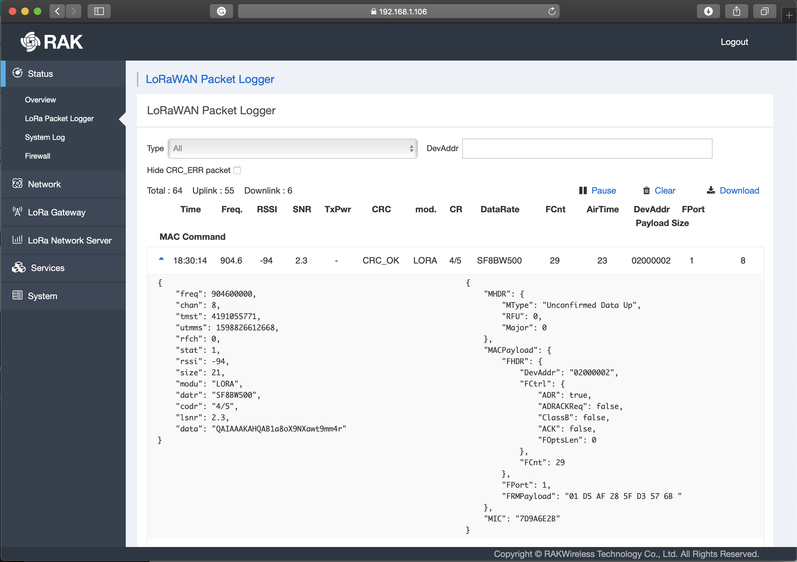
